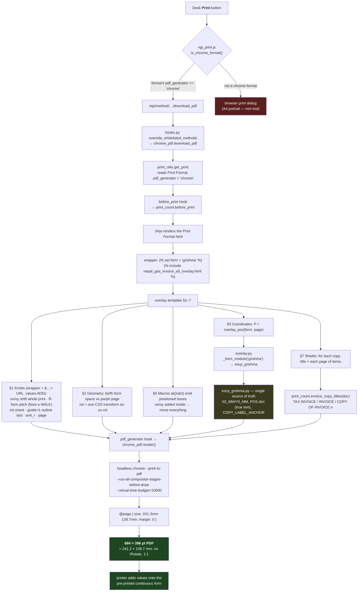
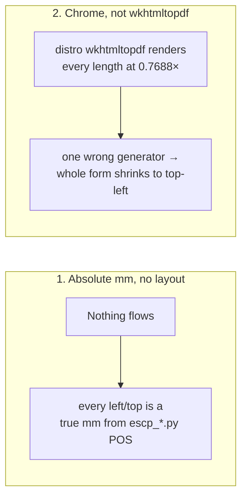
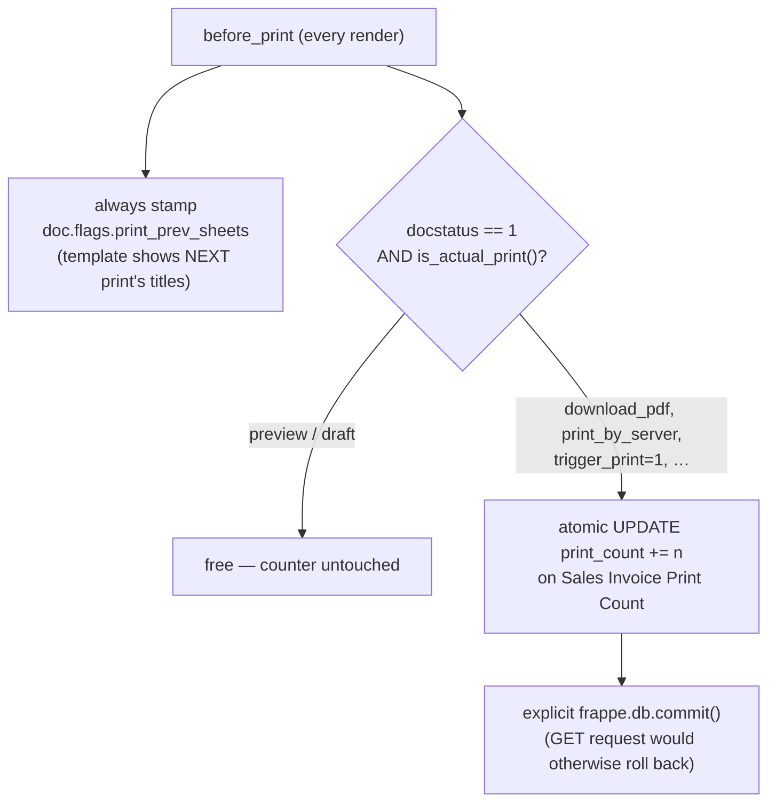

# A5 Overlay invoice printing — the flow

Visual companion to `how_overlay_print_works.md`. One diagram of the whole
chain, from the desk Print button to the 684 × 396 pt PDF the pre-printed form
soaks up.

## The pipeline

## The two load-bearing facts

## The counter branch (Stage 3c)

`before_print` runs on **every** render — preview included — but only the
*actual print* costs a sheet.

## Where to look when it breaks

| Symptom | Node in the flow |
| --- | --- |
| Whole form shrunk top-left | wkhtmltopdf got it — check `pdf_generator` on the record + `chrome_pdf` Error Log |
| Print rotated / sideways | driver, not the format — PDF has no `/Rotate`. Use `&rot=` |
| Everything a few mm off | `ox`/`oy` (§1 knobs), never a field number |
| One field off | that form's `escp_*.py` POS entry |
| Right columns pulled inboard | the A5 clamps — check `page` is not `'a5'` |
| Title half a label off | `COPY_LABEL_ANCHOR` disagrees with the emit site |
| Nothing changes for a branch | `Company Print Template` still routes to a Dot Matrix format |
| Print **walks** down the roll sheet after sheet | `fh` form pitch ≠ true perforation distance — `ox`/`oy` cannot fix a walk |

## Calibrating on a machine

Use the **`Overlay Print Test`** desk page (`page/overlay_print_test/` + `printing/test_bench.py`) — it builds live print URLs with the knob params (`&ox=`, `&oy=`, `&fh=`, `&rot=`, `&guide=1`) so a form can be dialled in without editing anything. Once right, bake `ox`/`oy`/`fh` into the wrapper Print Format's `` line.
